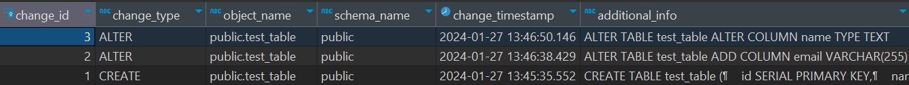

(WORK IN PROGRESS)

# Schema Auditing System

Inspired by a post on r/dataengineering, I sought to create a system which could log and identify schema changes in a database. The auditing system serves the following functions:

<ins>Change Tracking:</ins>
It provides a detailed record of when and how the database schema has changed over time, helping to understand the evolution of the database structure.

**Debugging and Troubleshooting:** 
Having a log of schema changes helps in diagnosing issues that may arise from recent changes to the database structure.

**Collaboration and Communication:** 
In environments where multiple teams or developers are working on the same database, it helps in communicating changes and ensuring that everyone is aware of the current state of the database schema.

## Setup
To set up a schema change auditing system, you need to create an audit table, and define event triggers for DDL statements. 

### Step 1: Create audit table for tracking DDL changes in the database schema

This is the table that will store the details of schema changes. This table can have columns for the type of change, the object affected, the time of the change, and other relevant details.

```ruby
CREATE TABLE schema_audit (
    change_id SERIAL PRIMARY KEY,
    change_type VARCHAR(50),
    object_name VARCHAR(255),
    schema_name VARCHAR(50),
    change_timestamp TIMESTAMP DEFAULT CURRENT_TIMESTAMP,
    additional_info TEXT
);
```

### Step 2: Create Event Triggers

PostgreSQL supports event triggers that can be fired on DDL (Data Definition Language), statements like `CREATE`, `ALTER`, and `DROP`. Create event triggers for these statements to log the changes in the audit table.

This trigger logs every `CREATE TABLE` statement:

```ruby
CREATE OR REPLACE FUNCTION log_ddl_create_event()
RETURNS event_trigger AS $$
BEGIN
    INSERT INTO schema_audit (change_type, object_name, schema_name, additional_info)
    SELECT 'CREATE', obj.object_identity, obj.schema_name, current_query()
    FROM pg_event_trigger_ddl_commands() AS obj
    WHERE obj.command_tag = 'CREATE TABLE';
END;
$$ LANGUAGE plpgsql;

CREATE EVENT TRIGGER trigger_on_create
ON ddl_command_end
WHEN TAG IN ('CREATE TABLE')
EXECUTE FUNCTION log_ddl_create_event();
```

This trigger logs every `CREATE TABLE` statement. Similar triggers for other DDL statements like `ALTER TABLE` and `DROP TABLE` can be created, and are found in the project file `schema_auditing_system.sql`.

### Step 3: Query the Audit Table

To get a list of schema changes, simply query the audit table:

```
SELECT * FROM schema_audit ORDER BY change_timestamp DESC;
```

This will give you a list of all schema changes, sorted by the time they occurred.

|  |
|:--:| 
| *schema_audit table* |


